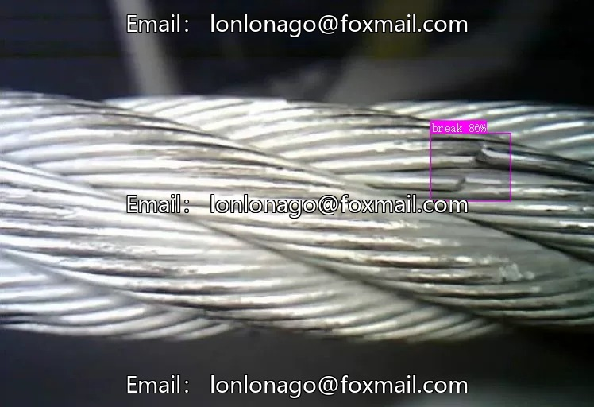
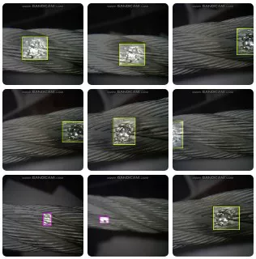
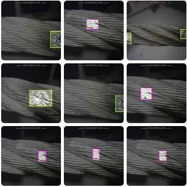
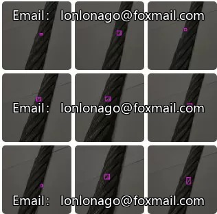

# YOLO-based steel cable damage detection dataset

## Body

YOLO (You Only Look Once) is a deep learning model that is used for object detection. It is a single-stage detector that can detect objects in real-time. The YOLO dataset is a collection of images and labels that are used to train the YOLO model.

The YOLO dataset includes various types of objects, such as cars, pedestrians, and animals. Each image in the dataset is labeled with the name of the object and its location on the image. The labels are important because they help the model learn how to recognize different objects in different contexts.

The YOLO dataset is important for researchers who want to develop models that can detect objects in real-time. It is also useful for developers who want to create applications that use object detection technology.

(Full product description was not available from the source page.)

## Images

## Payment

Here is a pay link on Stripe ( https://buy.stripe.com/3cs8yP7sY87d0vu9AB ). Please contact me lonlonago@foxmail.com after funding $89, and I will send you a complete data files , thank you!

